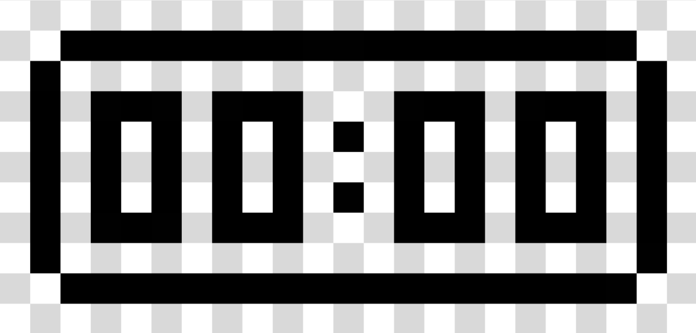
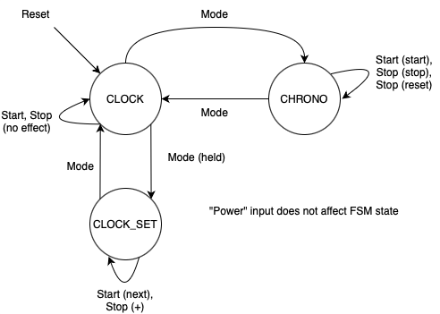

# ClockBox

Christopher Porco
18-224 Spring 2024 Final Tapeout Project

## Overview

My project is a clock with two primary modes: clock and chronograph. The clock simply keeps track of the time, and can be set by the user. The chronograph can be started, stopped, and reset. The mode input toggles between these two modes.

## How it Works

Here's a rough idea of what the clock looks like:

And each digit appears as follows:

The following FSM describes the high-level behavior of the design:

General operation is as follows: upon reset, you enter clock mode. The starting number of seconds is 0. If mode is asserted for 2 seconds, you will enter the clock set mode and can set the current time. Toggling start selects the next digit, while toggling stop adds to the currently selected digit. If the very middle LED illuminates, the time is PM. Toggle mode to exit back to the clock with seconds elasped equal to zero. This works like a normal clock (12 hour time), as you would expect.

Toggle mode in the clock mode to enter chronograph mode. Toggle start to start the chronograph, which increments to 89 minutes and 59 seconds (90 minutes) before overflowing back to 0. Toggle stop at any time to stop the chronograph. Assert stop for 2 seconds to reset the chronograph back to 0. Toggling mode brings you back to clock.

Both the clock and chronograph will continue incrementing if left running regardless of the current mode (except clock set for the clock) and regardless of the current LED brightness (including off).

## Inputs/Outputs

Inputs
1. Clock
2. Reset
3. Power
4. Mode (mode/set)
5. Start (start/next)
6. Stop (stop/reset/+)

Outputs
1. col_sel[0]
2. col_sel[1]
3. col_sel[2]
4. col_sel[3]
5. row_L[0]
6. row_L[1]
7. row_L[2]
8. row_L[3]
9. row_L[4]

This design requires a 10 MHz clock for accurate timing and visual effects (i.e. the LED display looks correct).

## Hardware Peripherals

This design requires a 5x17 LED display, an external decoder to process the col_sel output, and buttons to control the clock. Please get in touch if you are interested in acquiring the required LED display.

## Design Testing / Bringup

You can test the design by following the general operation description in the "How it Works" section above.

It is strongly preferred to have the hardware peripherals to which you can connect the design for testing.

If you would like to try the Python testbench, make sure to add the following line to chip.sv (source in clockbox_test.py should be "chip.sv" too): `timescale 1ns/1ns.

## Notes

For this project, I also designed, fabricated, and assembled the LED PCB for testing. I also designed a housing in Fusion 360 which I plan to CNC in the fall 2024 semester at Carnegie Mellon University as a part of 24-300: Intro to CNC Machining, for which I took the necessary prerequisite this semester.